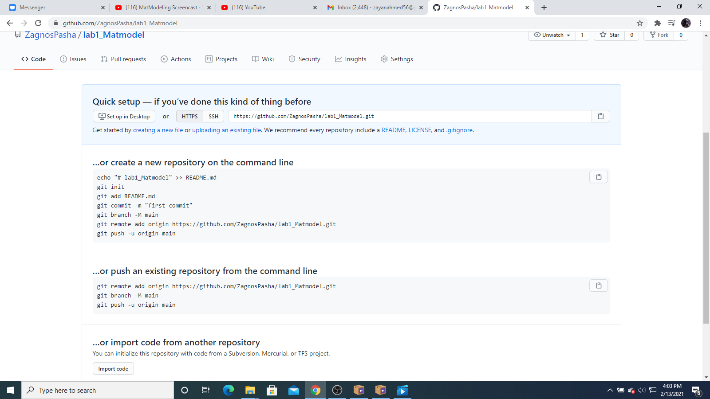
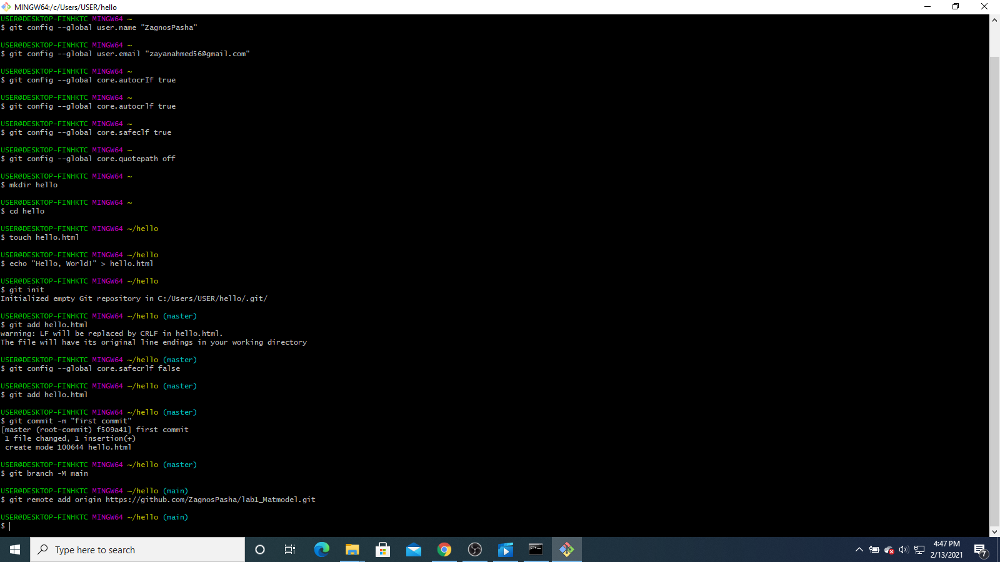
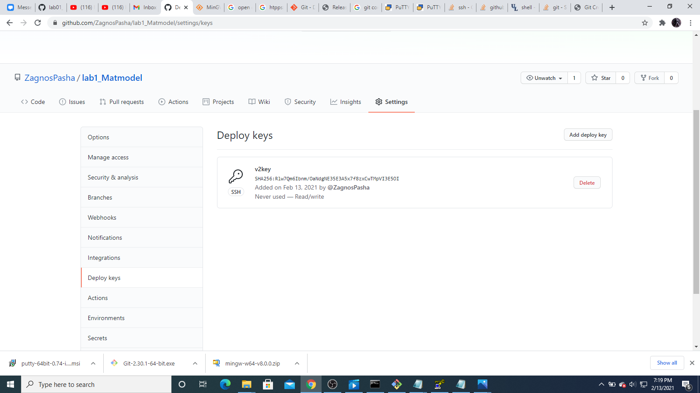
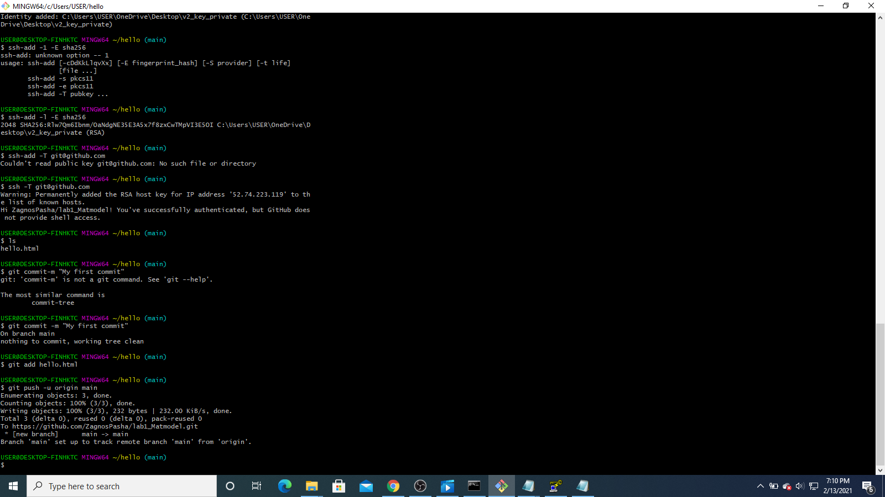
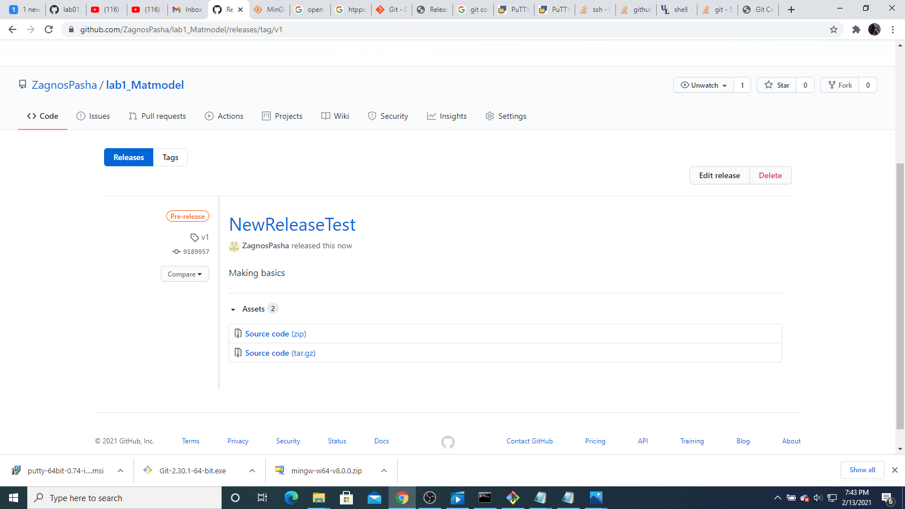

#People's Friendship University of Russia
##Lab report number 1
##Completed
###Student Name:Ally Mohammed Zayan Ahamed
###Group :HKH-01-18
###Lecturer:Kulyabov Dimitry Sergeevich

------

##Purpose

How to work with git version control systems

# Tasks

1.Create a repository
2.Create and upload files made on personal device to github
3.Make a commit and push to the github repository
4.Make a release
5.Generate a report and create a presentation in pdf,docx and markdown formatts
6.Create a final release

#Subject of the study

Git. Markdown

#List of Illustrations

1.Figure 1 -images/1.png
2.Figure 2 -images/2.png
3.Figure 3 -images/3.png
4.Figure 4 -images/4.png
5.Figure 5 -images/5.png
6.Figure 6 -images/6.png

# Technical equipments used
Computer,WiFi,Git console(Git bash),a notepad to write markdown files

# For lab work

Created a repository on github(fig. 1)

{Image 1}

{Image 2}

Downloaded and connected SSH keys (fig. 2)

{Image 3}

{Image 4}

Created a hello.html file and started it (fig.3)

{Image 5}

Made a release test on github (fig. 4)

{Image 6}

#Conclusions

Learned how to solve issues on github, how to make commits and push them.Learned how to mke releases and got accquainted with MarkDown
